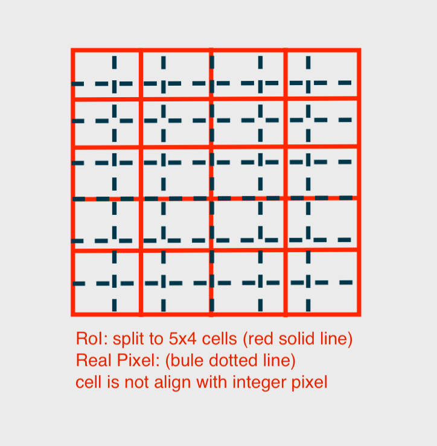
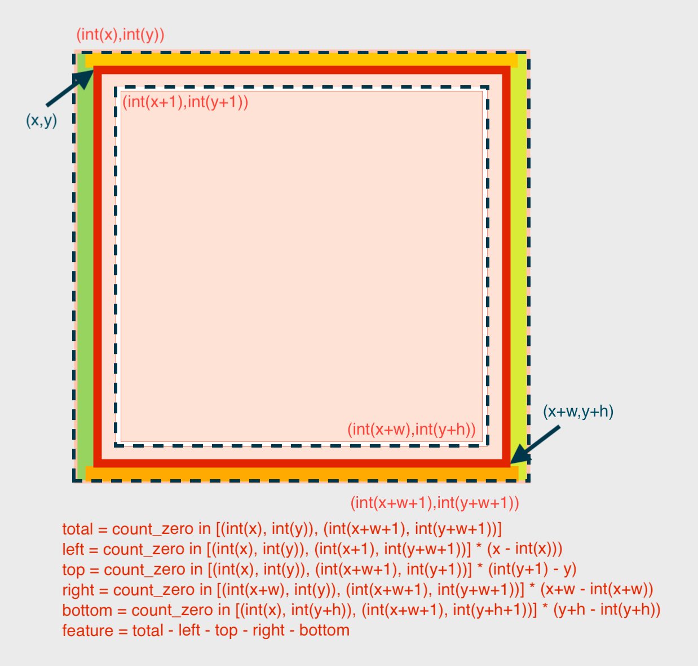
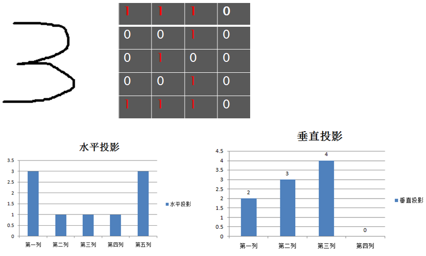

<!--
 * @Author       : Bingqiang Zhou
 * @Date         : 2021-09-09 00:15:59
 * @LastEditors  : Bingqiang Zhou
 * @LastEditTime : 2021-09-09 10:50:02
 * @Description  : 
-->

# 案例一 – 识别0～9印刷体数字

## 1. 实现识别的完整流程

1. 二值化输入的图像
2. 提取字符RoI区域
3. 对RoI提取特征向量
4. 与模版特征向量进行对比，计算L2距离
5. 最小距离对应的模版的标签即为该字符预测结果

### 相关代码

- 提取RoI特征向量的代码，见[utils.py](./utils.py)

- 实现整个识别流程的代码，见[app.py](./app.py)

## 2. 对RoI提取特征向量的过程

基于二值图像分析， 通过提取字符的40个特征向量生成字符特征

1. 对每个字符的ROI区域，计算高宽为5x4的网格，对每个网络计算像素个数，然后生成20个特征向量。
   - 在这个过程中充分考虑到浮点数Cell大小与分割，采用基于权重的分割方法，实现网格分割。

2. 对RoI区域进行X方向(宽)与Y方向(高)投影，每个投影直方图分为10个Bins，这样就得到了20个向量。

3. 分别对上述的结果进行0～1之间的归一化处理，得到最终的每个字符的40个特征向量表示。

这里对RoI提取40个特征向量，涉及到两个很关键的技巧：

- 浮点数权重，浮点数权重是可以提升准确率
- 归一化，归一化在某些程度上是可以保证字符的放缩不变性

## 3. 浮点数权重

### 为什么要使用浮点数权重计算Cell的特征值

在对每个字符的ROI区域划分为高宽为5x4的cell时，划分到每一个cell中的像素点数量可能不是整数的，如下图所示，其中红色框为划分的cells，蓝色框为真是像素点的排列。

### 一个cell对应的特征值的计算

如下图所示，其中x，y为cell的左上角坐标（浮点），w，h分别为cell的高宽（浮点），加上int(•)之后为向下取整的整数，如图红色实线区域，对应为cell区域，蓝色虚线区域分别为cell包含住的整数像素区域以及包含住cell的整数像素区域，简单来说，分别是对应cell向下向上取整的像素区域。

cell对应的特征值即为统计最外层区域内的值（例如0）分别减去带权的上下左右的统计值，具体为：外层与内层区域中间的上下左右边框区域包含的统计值的数量与cell与外层区域上下左右的距离差值的乘积（这个差值即为权重），具体计算公式见下图，其中(count_zero in \[\])表示在\括号[\(左上角坐标\), \(右下角坐标\)]区域内统计0值的数量。

## 对RoI区域X方向(宽)与Y方向(高)进行投影

如下图所示，分别对X方向(宽)与Y方向(高)进行数值统计

而X方向(宽)与Y方向(高)的像素点数量可能不能整除bins的数目，因此这里同样使用浮点数权重计算。

