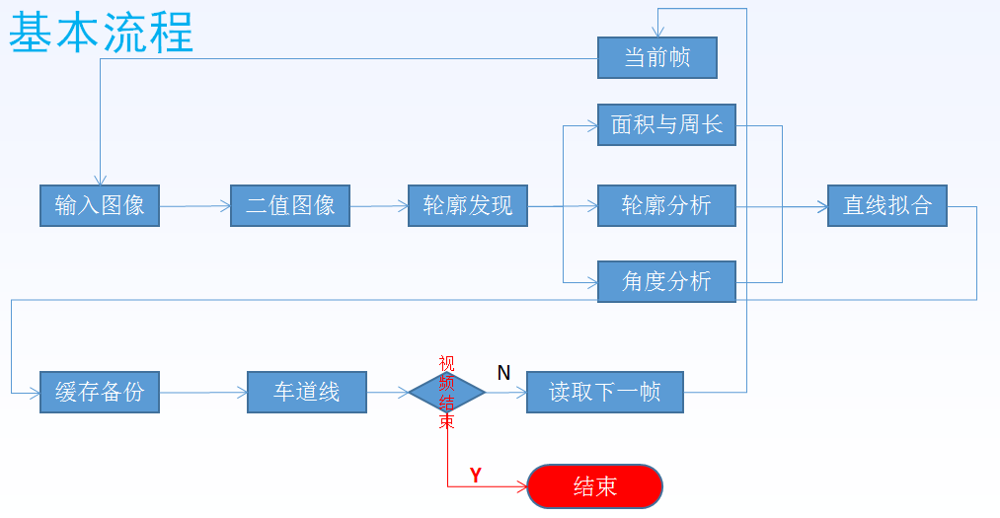

<!--
 * @Author       : Bingqiang Zhou
 * @Date         : 2021-09-09 16:05:00
 * @LastEditors  : Bingqiang Zhou
 * @LastEditTime : 2021-09-09 16:41:35
 * @Description  : 案例二 - 车道线检测
-->

# 案例二 - 车道线检测

传统的车道线检测，多数是基于霍夫直线检测，其实这个里面有个很大的误区，霍夫直线拟合容易受到各种噪声干扰，直接运用有时候效果不好，更多的时候通过霍夫直线检测进行初步的筛选，然后再有针对性的进行直线拟合，根据拟合的直线四个点坐标，绘制出车道线，这种方式可以有效避免霍夫直线拟合不良后果，是一种更加稳定的车道线检测方法，在实际项目中，可以选择两种方法并行，在计算出结果后进行叠加或者对比提取。

这里针对性的去掉一些干扰，在进行直线拟合，根据拟合的直线四个点坐标，绘制出车道线，完整流程如下：

1. 对灰度图进行边缘检测，如Canny
2. 通过设置RoI区域以及根据轮廓、轮廓面积与周长、边框(bbox)角度等量去掉一些干扰
3. 进行直线拟合
4. 根据斜率等其他量再去掉一些干扰
5. 根据边框(bbox)等高宽等信息，计算出直线初始点以及结束点，画出直线(车道线)

## 相关代码

- [app.py](./app.py)：未对直线进行其他处理

- [laneline_detection.py](./laneline_detection.py)：课程中提供代码，对左右车道线进行了不同的处理（视频中车辆靠右，右侧车道线较为明显），工作流程如图下所示：

