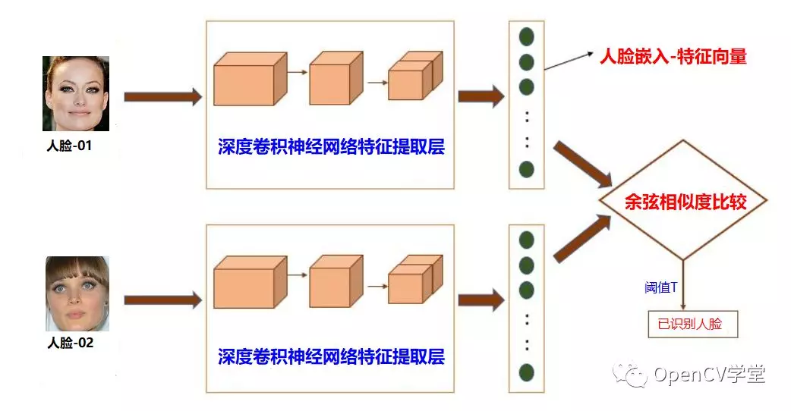
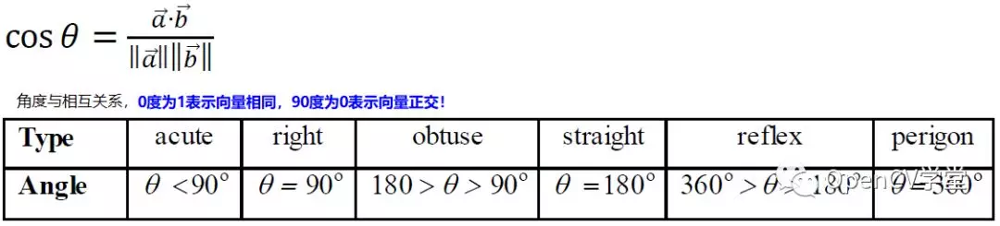

<!--
 * @Author       : Bingqiang Zhou
 * @Date         : 2021-09-10 10:12:11
 * @LastEditors  : Bingqiang Zhou
 * @LastEditTime : 2021-09-10 10:24:00
 * @Description  : 
-->

# 案例三 - DNN 人脸识别

人脸识别基本流程：
    1. 使用人脸检测模型，实现对图像或者视频的人脸检测
    2. 对得到的人脸区域通过人脸识别模型提取特征向量
    3. 基于余弦相似度进行特征值比对，实现人脸识别



## 余弦相似度



```python
def cos_similar(v1, v2):
    return np.sum(v1 * v2) / (np.linalg.norm(v1) * np.linalg.norm(v2))
```

## 相关代码

- [app.py](./app.py)：分别对图像以及视频进行人脸识别比对
