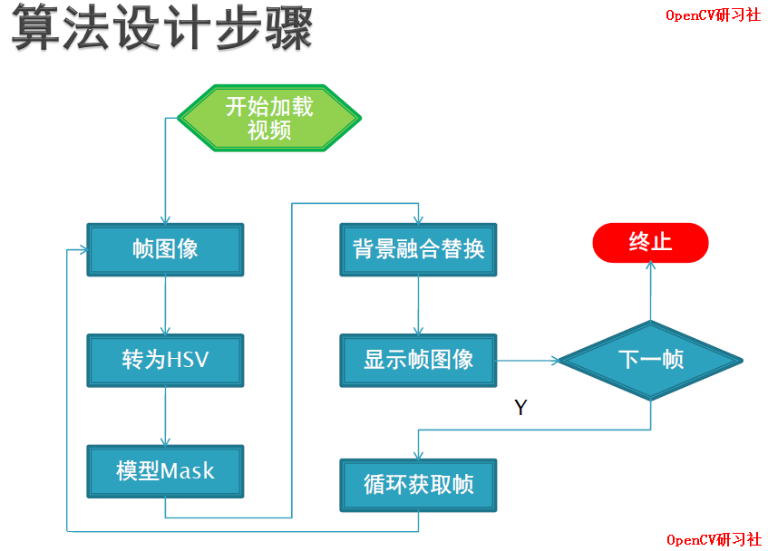

<!--
 * @Author       : Bingqiang Zhou
 * @Date         : 2021-09-10 17:49:04
 * @LastEditors  : Bingqiang Zhou
 * @LastEditTime : 2021-09-10 17:58:59
 * @Description  : 
-->

# 案例四 - 绿幕抠图

绿幕抠图基本流程：

1. 将输入图像转换为HSV色彩空间，inRange实现mask的提取
2. 通过一些简单的图像处理比如形态学开闭操作得到完整的mask区域
3. 运用高斯模糊生成权重系数
4. 对绿幕图像与背景图像重新融合生成一个新输出图像，完成抠图

